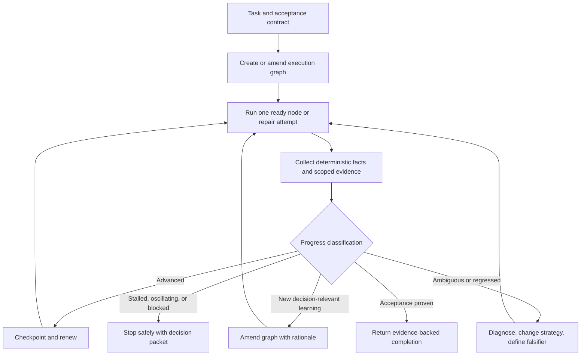

# Graphcraft plugin success strategy

Research snapshot: July 21, 2026

Status: product and adoption research retained as rationale for the durable plan.

Companion to [Graphcraft research and product scope](./graphcraft-research-scope.md). This document supersedes that report's four-day schedule and its recommendation that mandatory token budgets be the primary autonomy control.

## Executive decision

Graphcraft should be a **lightweight, progress-aware autonomy layer for existing coding agents**.

Its promise should not be “build agent graphs.” That describes the mechanism, not the result. The user-facing promise should be:

> **Keep coding agents working as long as they are still making useful progress.**

The agent should design and evolve the graph. The user should provide an outcome, inspect a one-screen run contract, and leave. Graphcraft should persist the work, give each step only the context it needs, verify progress after meaningful units of work, recover across sessions, and return an evidence-backed result.

The central control mechanism should be a **progress lease**:

1. A worker performs one meaningful unit of work.
2. Graphcraft collects task-specific evidence.
3. Demonstrated progress renews autonomous execution.
4. Ambiguous progress triggers diagnosis or replanning.
5. Repeated unchanged or oscillating evidence produces a safe stop and a decision packet.

Attempt counters, time limits, and token ceilings still have roles, but only as probe triggers and optional circuit breakers. They should not decide whether the work is productive.

Graphcraft will be significant if it makes users say:

> “I left the agent alone, it survived getting stuck and being restarted, and it finished without wasting context.”

It will not become significant merely because it can render a DAG.

## What the successful projects actually demonstrate

GitHub stars are an imperfect measure of use and do not prove causality. They do, however, show which promises, packaging choices, and stories spread unusually well. Current public signals are:

| Project | Public traction snapshot | Front-door promise | Immediate path |
|---|---:|---|---|
| [Superpowers](https://github.com/obra/superpowers) | 258,621 stars, 23,049 forks | A complete development methodology that coding agents use automatically | Install from a marketplace; ordinary requests activate skills |
| [GSD, original repository](https://github.com/gsd-build/get-shit-done) | 64,778 stars, 5,479 forks before moving | Solve context rot and make Claude Code reliably finish substantial work | One `npx` installer, then a small command loop |
| [GSD Core](https://github.com/open-gsd/gsd-core) | 6,948 stars; 37,550 npm downloads in the last complete 30-day window | “Claude Code is powerful. GSD Core makes it reliable.” | Guided multi-runtime installer |
| [Compound Engineering](https://github.com/EveryInc/compound-engineering-plugin) | 23,283 stars, 1,802 forks | Make every unit of engineering work make the next one easier | Marketplace install; explicit skills or one autonomous `/lfg` path |

The original and current GSD repositories should not be added together as unique users. The old package also recorded 31,616 download events over the same 30-day window; npm downloads are events, not unique installations.

### Superpowers: behavior users can feel immediately

Superpowers launched on the same day Anthropic introduced Claude Code plugins. Its launch article explicitly says the new distribution mechanism was the impetus to ship. That timing mattered, but the product also fit the new mechanism unusually well.

Its strongest adoption choices are:

- **One-sentence identity.** It is a complete software-development methodology for coding agents, not a bag of prompts.
- **No command memorization.** The agent checks and invokes relevant skills automatically.
- **A recognizable workflow.** Brainstorm, plan, implement, test, review, and finish are easy to explain.
- **Opinionated behavior.** TDD, worktrees, planning, and verification are rules rather than vague suggestions.
- **A vivid outcome.** The README says the agent can work autonomously for hours without deviating from the plan.
- **Official and native distribution.** It supports the official Claude and Codex marketplaces and many other harnesses.
- **Behavioral proof.** It tests real model sessions with pressure scenarios, not just whether Markdown files parse.
- **A founder story and public demo.** The launch article explains why it exists, shows realistic adversarial eval prompts, and links a full transcript.
- **Continuous refinement from observed failures.** Release notes document changes based on real token usage, behavior regressions, security issues, and user feedback.

The launch article is especially instructive. It does not lead with plugin architecture. It shows that a normal request now causes the agent to plan, isolate work, use TDD, dispatch implementation, and offer a clean finish. The technical novelty is translated into a behavioral before-and-after.

Superpowers also learned an important efficiency lesson. Its June 2026 release reduced a bootstrap injected into every session because that cost was paid constantly. It removed redundant per-harness guidance and stopped using a Codex session-start hook once native skill discovery was good enough. It also removed expensive subagent review loops after repeated trials found no quality improvement. This is a strong precedent for Graphcraft: measure a mechanism and delete it when it does not improve accepted outcomes.

### GSD: one painful problem, named plainly

GSD's strongest strategic decision was to name a failure users already felt: **context rot**. It presents a simple diagnosis:

- long sessions become noisy;
- conversation memory is fragile;
- code is declared done without adequate verification.

Its solution maps directly to those problems:

- heavy work runs in fresh contexts;
- `STATE.md`, `CONTEXT.md`, plans, and summaries persist outside conversation history;
- verification is a required stage.

The historical README made the product especially approachable:

> “The complexity is in the system, not in your workflow.”

That sentence captures a major reason for its spread. Internally, GSD is a large orchestration system. Externally, the original experience was a one-line installer and six verbs. The README also used testimonials, an animated terminal image, a founder narrative, explicit social proof, and a direct outcome-oriented name.

Other effective choices include:

- **A one-command installer** that detects and configures the user's runtime.
- **Durable, inspectable Markdown state** rather than opaque service state.
- **A repeated phase rhythm** users can learn once.
- **A tutorial that builds something real**, rather than explaining every concept before the first run.
- **Multilingual documentation** and broad runtime support.
- **Profiles for context footprint.** Its minimal installation advertises roughly 130 description tokens versus roughly 1,200 for the full surface.
- **Visible maintenance and community.** GSD Core had 1,072 merged PRs and 157 contributor entries in the GitHub API snapshot.

GSD also exposes the risk Graphcraft must avoid. Its current full system has many commands, agents, capabilities, generated adapters, and lengthy orchestration prompts. That depth supports advanced users but would be a poor first version of a plugin whose differentiator is low overhead. Graphcraft should copy the simple front door and durable artifacts, not the entire surface area.

### Compound Engineering: a philosophy with a flywheel

Compound Engineering succeeds at a different layer. Its central claim is not merely that an agent will finish a task. It is that each task should improve the system that performs the next task.

That creates a memorable worldview:

> Brainstorm → Plan → Work → Simplify → Review → Compound

The loop is both a method and a content engine. Every's articles tell stories about an agent applying lessons from earlier pull requests. The plugin turns that story into commands and stores reusable learning under `docs/solutions/`. The methodology, repository, and Every's publishing audience reinforce one another.

Its strongest adoption choices are:

- **A philosophy that fits in one sentence.** “Each unit of engineering work should make subsequent units easier.”
- **An explicit autopilot.** `/lfg` takes a bounded feature through planning, implementation, review, PR creation, and CI repair.
- **A staged manual path and a one-command autonomous path.** Users can inspect every step or delegate the entire pipeline.
- **Durable learning artifacts.** The system has a reason to become more valuable after repeated use.
- **Examples for several intents.** The README shows feature, debugging, ideation, autonomous, and targeted simplification paths.
- **Cross-harness packaging** and active release work.
- **Owned distribution.** Every's publication gave the underlying philosophy an audience before and alongside the plugin.

Compound Engineering also provides the clearest warning about context bloat. A February 2026 audit found about 50,500 always-loaded description characters against a 16,000-character fallback budget, causing components to be silently excluded. The remediation moved examples out of discovery metadata, made side-effecting workflows explicit-only, and projected a 79% reduction to about 10,400 characters. The lesson is not merely “write shorter prompts.” It is to make **discovery, invocation, and reference material separate loading tiers**.

Its design note on non-convergence closely matches the direction Graphcraft should take. The note argues that counters detect attempts, not progress. It distinguishes legitimate failure migration from oscillation, keeps compact temporal facts in the orchestrator, assigns semantic judgment to task-specific leaves, and treats hard limits as triggers or backstops. Graphcraft can generalize that approach beyond pull-request babysitting.

## The shared success pattern

The three projects differ in implementation, but their adoption pattern is remarkably consistent.

### 1. They sell a changed outcome, not a component model

- Superpowers: your agent follows a disciplined methodology automatically.
- GSD: your agent stays reliable despite long work and context pressure.
- Compound Engineering: today's work makes tomorrow's work easier.

Graphcraft's equivalent cannot be “agents can generate graphs.” It should be “agents keep making verified progress for as long as useful.”

### 2. They name an enemy

- Superpowers opposes undisciplined, jump-straight-to-code behavior.
- GSD opposes context rot.
- Compound Engineering opposes starting from zero and accumulating rediscovery.

Graphcraft's enemy is **opaque churn**: the agent is still spending tokens, but neither the user nor the agent can prove the task is closer to done.

### 3. They provide a front door with almost no learning cost

- Marketplace install and automatic behavior.
- One `npx` command.
- One autonomous `/lfg` command.

Their internal complexity is not the onboarding experience. Graphcraft should require neither YAML nor graph theory to start.

### 4. They are opinionated enough to be recognizable

A generic prompt toolbox is hard to describe and easy to replace. Each successful project has a named loop and clear defaults. Graphcraft needs its own small mental model:

> **Plan the work. Prove progress. Renew or replan. Resume until accepted.**

### 5. They create durable artifacts

Plans, state files, decisions, review results, and learning documents make the work inspectable and recoverable. They also give the community something concrete to share and improve.

### 6. They prove model behavior, not just software behavior

Plugin tests are necessary but insufficient. Superpowers runs adversarial behavior scenarios. GSD verifies plans and completed phases. Compound Engineering records evaluation rubrics and convergence cases. A coding-agent plugin is only real when the model behaves correctly under pressure.

### 7. They meet users in their preferred harness

Portability increases the audience and reduces platform risk. Native marketplace installation is much more credible than “copy these files into a hidden directory.” However, every added harness creates a permanent compatibility obligation. The successful pattern is a simple common methodology with thin native adaptations.

### 8. They have a story people want to repeat

“Give your agent superpowers,” “get shit done,” and “make every task compound” are social objects, not technical specifications. Graphcraft needs an equally repeatable sentence and a striking demonstration.

### 9. They visibly dogfood and maintain the system

Detailed release notes, repository-native plans, fast fixes, community links, and many merged contributions signal that the methodology is used on itself. Trust in an autonomy tool comes from seeing its maintainers expose failures and improve the system.

## What Graphcraft should copy—and what it should refuse

| Copy | Why | Do not copy |
|---|---|---|
| One-line, outcome-focused promise | Makes the project legible in seconds | A feature inventory above the quickstart |
| One-command or marketplace installation | Reduces abandonment before first value | Manual copying into several agent directories |
| One autonomous entry point | Makes the main benefit tangible | Six required commands for every run |
| Progressive disclosure | Keeps idle context small | Dozens of always-visible skills and agents |
| Durable plain-text state | Enables trust, resume, and debugging | Conversation transcripts as the state database |
| Opinionated defaults | Produces repeatable behavior | Mandatory ceremony for small tasks |
| Behavioral pressure evals | Tests the actual product | Prompt unit tests that only check phrase recall |
| Cross-harness semantics | Expands reach and reduces lock-in | Fifteen adapters before one execution path is excellent |
| Honest benchmark receipts | Makes efficiency credible | “Saves tokens” without an accepted-completion baseline |
| A public demonstration and founder story | Gives people a reason to share | An architecture-first launch |
| Community extension points | Lets useful patterns accumulate | Accepting arbitrary graph templates before their value is demonstrated |

Graphcraft should especially refuse five sources of bloat:

1. A large bootstrap loaded into every conversation.
2. A separate skill for every task type.
3. Broad parallelism as the default answer to latency.
4. Model calls for polling, parsing, counting, hashing, routing, or status formatting.
5. A graph canvas before the execution kernel and progress semantics are trusted.

## Product definition

### The product

Graphcraft is a plugin plus a deterministic local runtime that lets a coding agent:

- turn a substantial task into a living execution graph;
- attach acceptance and progress probes to its nodes;
- execute ready work through the user's existing coding agent;
- store state, evidence, and large artifacts outside model context;
- change the graph when new evidence invalidates the original plan;
- resume after interruption or a new session;
- stop, diagnose, or request a decision when progress is no longer credible;
- report token usage and accepted progress together.

The graph is **agent-authored, user-inspectable, and runtime-enforced**. The user does not have to draw it.

### The boundary

Graphcraft should not become:

- a new coding-agent chat application;
- a replacement for Codex, Claude Code, or their native goals;
- another issue tracker or project-management database;
- a general LangGraph-style application framework;
- a multi-agent office or swarm manager;
- a collection of software-engineering methodology skills;
- a visual graph editor as the primary interface.

It should compose with existing methods. A graph node may tell a Superpowers-enabled worker to follow TDD. A GSD plan can be imported as graph nodes. A Compound Engineering pipeline can be represented as a template. Graphcraft owns execution state, progress evidence, context efficiency, and recovery—not every engineering opinion inside a node.

## The easiest possible user experience

### Installation

The desired order is:

1. Official Codex and Claude marketplaces.
2. A guided `npx` installer as a fallback and for other supported runtimes.
3. Manual installation only for contributors.

The installer should detect the host and offer a sensible scope. It should not ask users to configure models, storage, graph syntax, concurrency, token budgets, or probe thresholds before their first run.

### First run

The primary invocation should be one command or a natural-language request:

```text
/graphcraft migrate this package from REST client v2 to v3 and open a PR
```

or:

```text
Use Graphcraft for this migration. Keep going while you can prove progress.
```

Graphcraft responds with a one-screen contract, not a full graph dump:

```text
Outcome       All v2 call sites migrated; tests and typecheck pass
Progress      Remaining call sites, compile errors, focused tests, full suite
Boundaries    This repository; normal git commits; ask before push or PR
Recovery      Checkpoint after each accepted node; resumable after restart
Plan shape    Inventory → migrate in waves → integrate → verify → prepare PR

Start? [Y/n]
```

After that approval, the graph runs. Advanced users can inspect or amend it, but inspection is not a prerequisite.

### Everyday controls

Keep the stable command vocabulary small:

```text
/graphcraft <task>       start
/graphcraft status       concise evidence and next action
/graphcraft inspect      graph, node contracts, and trace
/graphcraft pause        checkpoint and stop safely
/graphcraft resume       continue from durable state
/graphcraft stop         close with current evidence and blockers
```

Everything else belongs under advanced documentation or CLI flags.

### Small-task bypass

“No graph needed” must be a successful result. If the task is a localized change that fits one focused agent turn, Graphcraft should say so and let the host agent proceed normally. This protects both ease of use and token efficiency.

### Trust progression

The first run should require approval of the contract and risky side effects. Later, the user can opt into a trust profile that automatically accepts familiar repository-local actions while retaining gates for secrets, destructive actions, pushes, PRs, deploys, and ambiguous product decisions.

Do not ask the user to choose “interactive,” “yolo,” “balanced,” or “expert” before they have seen the product work.

## Progress leases: the core innovation

A progress lease is not a fixed number of minutes or tokens. It is permission to continue autonomous work because the latest evidence supports the belief that the run is converging.



### Never reduce progress to one generic score

Different tasks expose different evidence. A single number will be gamed, accidentally or otherwise. Graphcraft should maintain a task-specific progress vector and a small common vocabulary:

- **advanced** — at least one acceptance-relevant measure improved without invalidating a more important measure;
- **learning** — new evidence materially reduced uncertainty or changed the viable plan;
- **stalled** — work occurred but acceptance-relevant evidence did not change;
- **regressed** — important evidence worsened;
- **oscillating** — a previously cleared failure or state recurred in a cycle;
- **blocked** — further movement requires unavailable authority, information, or external state;
- **done** — the completion probes pass.

“Files changed,” “tokens spent,” “commands run,” and “a longer plan exists” are not progress by themselves.

### Separate temporal facts from semantic judgment

The runtime should deterministically collect compact facts:

- test and check signatures;
- acceptance criteria satisfied or invalidated;
- remaining inventory;
- blocker identities;
- head SHA and artifact hashes;
- repeated tool failures and unchanged reads;
- graph mutations and their evidence;
- context and token usage;
- scope growth.

Task-specific probes then interpret those facts. For example, a migration probe knows that remaining v2 call sites falling from 84 to 31 is progress. A bug-fix probe knows that replacing one failing test with a different failing test may be either useful migration or a regression. The core runtime should not pretend those are the same domain judgment.

### Counters trigger scrutiny; evidence decides

Useful default behavior is:

1. The first unchanged or repeated signature triggers a cheap progress probe.
2. Continued repetition triggers a diagnostic node that must name the suspected invariant, propose a different strategy, and state what result would falsify it.
3. If the new strategy still does not change the evidence—or the run cycles back to a cleared state—Graphcraft stops or asks for a decision.

The exact attempt count is not proof of failure. It merely ensures that optimism cannot postpone scrutiny forever.

Optional token, time, and model-call ceilings remain valuable as user-configured circuit breakers, especially in unattended runs. Reaching one checkpoints and requests authorization; it does not retroactively classify the work as unproductive.

### Initial probe families

| Task family | Useful progress evidence | False-progress traps |
|---|---|---|
| Bug fix | Reproduction established; failing regression test; failure signature changes for a reason; targeted and broader tests pass | Deleting or weakening the test; changing unrelated code; replacing one unexplained failure with another |
| Feature | Acceptance scenario implemented; focused behavior verified; integration boundaries satisfied; full checks remain healthy | Counting files or lines; checking boxes without behavior evidence |
| Migration | Inventory decreases; compile/type errors decrease; migrated slices pass; deprecated dependency disappears | Hiding call sites; excluding packages from checks; broad rewrites without inventory movement |
| Refactor | Behavior preserved; target complexity or duplication decreases; affected tests pass | Churn presented as simplification; coverage loss; scope expansion |
| PR repair | Unresolved findings and failing checks decrease; cleared signatures do not recur; mergeability improves | Bot-thread treadmill; A/B ping-pong; declaring parked findings complete |
| Research or audit | Required questions receive credible evidence; unknowns shrink; conclusions become decision-ready | Collecting more sources without changing confidence or decisions |

Probe templates should be small code-plus-schema packages, not separate always-loaded skills.

## Token efficiency by construction

Graphcraft should treat context as a runtime resource and tokens as telemetry tied to accepted outcomes.

### Strict footprint controls are appropriate for the plugin itself

The objection to hard run budgets does not mean Graphcraft's idle context should grow without a guard. CI should measure and ratchet:

- always-loaded discovery characters and estimated tokens;
- activation prompt size;
- per-adapter injected guidance;
- graph context packet sizes;
- raw-output leakage into model calls.

A good initial shape is one discovery entry under roughly 250 tokens and one core activation document under roughly 1,000 tokens, with host-specific and advanced references loaded only on demand. These are engineering targets, not limits on how long a productive user task may run.

### Runtime efficiency rules

1. **One worker by default.** Parallelism requires independent nodes and a clear latency benefit.
2. **Event-driven waiting.** Polling, file watching, CI observation, and process liveness use deterministic code and wake a model only when the state changes.
3. **Context capsules.** A node receives its objective, constraints, selected state, relevant predecessor results, artifact references, and output contract—not the whole run transcript.
4. **Artifacts over pasted output.** Logs, diffs, inventories, and research live on disk; models receive filtered summaries and paths.
5. **Hash and reuse.** Unchanged files, scans, and summaries are not repeatedly processed.
6. **Fresh context when noise is high.** Exploration and large logs should not pollute implementation reasoning.
7. **Reuse context when dependency is high.** A new session is not automatically cheaper if it must reread the same code and decisions.
8. **Deterministic work stays deterministic.** Graph traversal, state updates, schemas, filtering, metrics, retries, and status rendering require no model call.
9. **Model routing follows evidence.** Do not introduce several model tiers until benchmarks show that routing improves tokens to accepted completion.
10. **Planning overhead is counted.** A benchmark that omits Graphcraft's own graph-generation tokens is invalid.

The primary efficiency metric remains **tokens to accepted completion**. Lower token use with more defects or human repair is not a win.

## Technical architecture

| Component | Responsibility |
|---|---|
| Thin host plugin | Discovery, explicit invocation, natural-language handoff, concise status |
| Graphcraft runtime | Scheduling, durable state, checkpoints, graph amendments, approvals, recovery |
| Graph compiler | Turn outcome and constraints into a typed graph; fuse, split, or bypass nodes |
| Probe engine | Capture facts, run deterministic checks, invoke scoped semantic verifiers when needed |
| Context packer | Select node-relevant state and artifact references; enforce output filtering |
| Host adapters | Execute workers through Codex, Claude Code, and later other harnesses |
| Artifact store | Logs, diffs, inventories, evidence, plans, and result packages |
| Trace and token ledger | Explain what ran, why leases renewed, why the graph changed, and what it cost |
| Evaluation harness | Baseline comparisons, interruption tests, behavioral pressure scenarios |

### Living graph semantics

An up-front graph cannot predict every repository discovery. Graphcraft should permit amendments, but every amendment must record:

- the evidence that made the old path insufficient;
- the nodes and dependencies added, removed, or changed;
- whether scope or permissions changed;
- the new probes or completion conditions;
- the model or user responsible.

This preserves autonomy without turning the graph back into an invisible chat loop.

### Minimal graph contract

Each run needs:

- outcome and acceptance criteria;
- repository and side-effect boundaries;
- nodes with dependencies and typed results;
- progress and completion probes;
- context selectors;
- artifact references;
- approval gates;
- recovery and idempotency semantics;
- graph-amendment history;
- token and elapsed-time telemetry;
- optional user circuit breakers.

The human-readable representation can be YAML or JSON, but the user should never have to author it for the normal path.

### State layout

Use a small, inspectable project directory such as:

```text
.graphcraft/
  run.json             current compact state
  graph.json           versioned graph contract
  events.jsonl         append-only decisions and transitions
  artifacts/           logs, inventories, diffs, evidence
  capsules/            reproducible node input manifests
  reports/             final and benchmark reports
```

The default should be safe around git: explain what is ephemeral, what may be committed, and provide a generated ignore policy. Do not silently commit orchestration state.

## A roadmap without a four-day ceiling

The order should follow evidence, not calendar time. Each milestone has an exit proof.

### Milestone 0: define the product contract and eval corpus

- Specify progress states, graph mutations, approvals, and resume semantics.
- Select at least five real repository tasks across bug fix, feature, migration, PR repair, and research.
- Capture baseline runs using the same model, effort, permissions, and repository state.
- Define accepted completion independently of Graphcraft.
- Design pressure scenarios for false progress, oscillation, and legitimate multi-step failure migration.

**Exit proof:** the same task can be scored without knowing whether Graphcraft ran it.

### Milestone 1: one excellent durable execution path

- Build the runtime, event log, graph validator, artifact store, pause, and resume.
- Implement one host adapter deeply—Codex is a practical first choice because structured execution events and token reporting make measurement straightforward.
- Support sequential graphs, graph amendments, approval gates, and crash-safe checkpoints.
- Package one thin plugin entry point.

**Exit proof:** kill a real run mid-task, restart the host process, and finish without repeating accepted nodes or losing decisions.

### Milestone 2: progress-aware autonomy

- Implement deterministic snapshot and delta collection.
- Ship the first five task probe families.
- Add diagnostic and replan nodes.
- Detect unchanged state, recurrence, oscillation, blockers, and scope growth.
- Generate a self-contained decision packet on safe stop.

**Exit proof:** behavioral evals distinguish ordinary A→B→done repair from A↔B oscillation, and distinguish productive research from repeated searching.

### Milestone 3: context and token optimizer

- Build context capsules, output filters, artifact hashing, and reuse.
- Add node fusion and small-task bypass.
- Compare fresh versus reused contexts based on task dependencies.
- Add token and context traces, including Graphcraft overhead.
- Remove any orchestration step that does not improve accepted outcomes.

**Exit proof:** on substantial tasks, Graphcraft improves median tokens to accepted completion without lowering acceptance rate. Publish the raw traces and negative results.

### Milestone 4: frictionless public product

- Add the Claude Code adapter and native packaging for Codex and Claude.
- Build the one-screen run contract and concise status UX.
- Create a first-project walkthrough that finishes a useful task quickly.
- Make install, update, uninstall, and recovery idempotent.
- Add Windows and Linux coverage in addition to macOS.

**Exit proof:** a new user can install, start a real run, understand why it is continuing, and resume it without reading the architecture docs.

### Milestone 5: extension and composition

- Publish a probe SDK and graph-template schema.
- Import plans from common plain-text formats.
- Add adapters to existing task graphs rather than building a new tracker.
- Let other methodologies supply node instructions without entering the core prompt.
- Add signed or provenance-aware community packages.

**Exit proof:** an external contributor can add a probe family without changing the core runtime or increasing idle context.

### Milestone 6: ecosystem and team use

- Shared trace viewer and run comparison.
- Organization policy packs for approvals and evidence.
- Remote workers or schedulers while retaining local inspectability.
- Reusable, validated graph patterns learned from successful runs.
- Explicit, consent-based compounding of local lessons.

**Exit proof:** teams can adopt policies and share useful probes without centralizing their source code, secrets, or raw transcripts in Graphcraft.

## The launch should demonstrate one unforgettable thing

The best launch demo is a real repository migration:

1. Inventory a deprecated API across many call sites.
2. Migrate independent slices.
3. Encounter an injected or natural failure that causes the first strategy to stall.
4. Show Graphcraft detect the lack of progress and amend the graph.
5. Terminate the coding-agent process midway.
6. Resume in a new session without redoing accepted work.
7. Finish the migration and show acceptance evidence.
8. Compare tokens, repeated reads, elapsed time, and defects with a baseline run.

That single demonstration shows why the graph matters, why progress probes matter, why durable state matters, and why token-efficient context slicing matters. A screenshot of a complex graph shows none of those things.

### README above the fold

The first screen should be approximately:

```text
# Graphcraft

Keep coding agents working as long as they're still making progress.

[Install in Codex] [Install in Claude Code]

/graphcraft migrate this package from REST client v2 to v3

[60-second terminal demo]
```

Then explain:

- what changed compared with a normal long-running session;
- how progress was proven;
- how interruption recovery works;
- measured token results;
- how to inspect or stop the run.

Architecture, complete command inventories, and every supported harness belong later.

### Distribution and community

- Apply for official marketplaces early; installation credibility is part of the product.
- Maintain native manifests from one tested semantic source.
- Start with GitHub Discussions and issue templates before opening a separate chat community that requires moderation.
- Publish complete traces for a small benchmark corpus.
- Invite “show us your run” reports, especially failures and safe stops.
- Make probe packs the primary contribution surface; accept graph templates only with repeatable evidence.
- Keep release notes outcome-oriented and candid about removed mechanisms.
- Dogfood Graphcraft on Graphcraft and link the traces from significant pull requests.
- Add opt-in, minimal telemetry only if it answers a product question that local reports cannot; never collect source, prompts, or artifacts.

### Content strategy

The launch article should be a story, not a manifesto about DAGs:

1. The agent looked busy but was repeating the same work.
2. Token caps stopped good work and failed to diagnose bad work.
3. A task-specific progress contract let autonomy continue when justified.
4. The run survived a restart and finished.
5. Here are the receipts and the open-source project.

The repeatable phrase is:

> **Autonomy should be earned by progress, not purchased with unlimited tokens.**

## Evaluation and north-star metrics

The north star should be **accepted autonomous progress per model token**, reported through understandable supporting measures rather than one opaque score.

Track:

- accepted task completion rate;
- uncached and cached tokens to accepted completion;
- human interventions per accepted run;
- longest productive interval between interventions;
- resume success after process and session interruption;
- repeated file reads and repeated unchanged failure signatures;
- false-continue rate: Graphcraft kept spending on a stalled or oscillating path;
- false-stop rate: Graphcraft stopped a path that was legitimately converging;
- time from install to first accepted checkpoint;
- idle and activated context footprint;
- small-task bypass precision;
- defects found in post-run review.

Behavioral evaluation scenarios should include:

- time pressure encouraging the agent to skip progress probes;
- an apparently easy task that should bypass Graphcraft;
- A fixed, then B appears once, then completion;
- A and B alternating after each attempted repair;
- a migration inventory decreasing while new compile errors surface;
- a worker producing many edits without changing acceptance evidence;
- a missing credential or product decision that requires the user;
- a process killed before and after a checkpoint;
- a graph amendment that quietly expands repository scope;
- an attempt to weaken a test or exclude files to make a metric green.

Run the same tasks without Graphcraft. Use multiple repetitions where model variance matters. Publish failures as well as wins.

## Naming recommendation

The successful projects have names that express a benefit or a worldview. **Graphcraft** expresses a mechanism. It is a strong working name for the methodology, but it has search and package collisions: an npm package, multiple exact-name GitHub repositories, and the `GraphCraft` GitHub organization already exist.

| Name | Strength | Weakness | July 21, 2026 namespace snapshot |
|---|---|---|---|
| **Graphcraft** | Owns the graph-engineering concept; already natural in this discussion | Technical rather than emotional; significant collision | Exact GitHub names, org, and npm name occupied |
| **Longlight** | Captures both priorities: long-running and light context | More evocative than descriptive | Exact repo, npm, and PyPI package appeared clear; GitHub user occupied |
| **Flowsteward** | Communicates responsible supervision and trust | Less punchy and less obviously about coding agents | Exact repo, GitHub account, npm, and PyPI appeared clear |
| **Everwright** | Memorable suggestion of continuous correct work | Meaning needs a tagline | Exact repo, GitHub account, npm, and PyPI appeared clear |
| **Runwright** | Best wordplay and tagline: “Long-running agents, done right” | Existing 68-star exact-name GitHub project | npm and PyPI appeared clear |

These checks are not trademark, company-name, domain, or app-store clearance.

### Recommendation

Keep **Graphcraft** as the working title while proving the product. It is useful language for the graph IR and the broader methodology.

Before a major public launch, prefer **Longlight** as the product brand if legal and domain clearance succeeds:

> **Longlight — long-running coding agents, light on context.**

If a more infrastructure-oriented identity is desired, choose **Flowsteward**:

> **Flowsteward — autonomy that earns its next step.**

Do not spend weeks naming the project before the resume-and-replan demo works. The successful repositories became memorable because the name compressed a real experience.

## Final product thesis

> **Graphcraft is a lightweight, progress-aware autonomy layer for coding agents. It turns substantial work into a living execution graph, stores state and evidence outside model context, renews autonomous execution only when task-specific probes show useful progress, survives interruption, and measures tokens to accepted completion.**

The shortest public version is:

> **Keep coding agents working as long as they're still making progress.**

That is distinct enough to matter, broad enough to become a platform, and narrow enough to build and evaluate honestly.

## Primary sources

Repository files below are linked to the exact commits inspected for this research.

### Superpowers

- [README and workflow](https://github.com/obra/superpowers/blob/d884ae04edebef577e82ff7c4e143debd0bbec99/README.md)
- [Original launch article](https://blog.fsck.com/2025/10/09/superpowers/)
- [Automatic skill bootstrap](https://github.com/obra/superpowers/blob/d884ae04edebef577e82ff7c4e143debd0bbec99/skills/using-superpowers/SKILL.md)
- [Behavioral evaluation approach](https://github.com/obra/superpowers/blob/d884ae04edebef577e82ff7c4e143debd0bbec99/docs/testing.md)
- [Release notes, including token and review-loop reductions](https://github.com/obra/superpowers/blob/d884ae04edebef577e82ff7c4e143debd0bbec99/RELEASE-NOTES.md)

### GSD

- [GSD Core README](https://github.com/open-gsd/gsd-core/blob/c5e0371775f856f78072e64fc9a85e488c12477b/README.md)
- [Context-engineering explanation](https://github.com/open-gsd/gsd-core/blob/c5e0371775f856f78072e64fc9a85e488c12477b/docs/explanation/context-engineering.md)
- [Phase-loop explanation](https://github.com/open-gsd/gsd-core/blob/c5e0371775f856f78072e64fc9a85e488c12477b/docs/explanation/the-phase-loop.md)
- [First-project tutorial](https://github.com/open-gsd/gsd-core/blob/c5e0371775f856f78072e64fc9a85e488c12477b/docs/tutorials/your-first-project.md)
- [Minimal-install context profiles](https://github.com/open-gsd/gsd-core/blob/c5e0371775f856f78072e64fc9a85e488c12477b/docs/how-to/install-minimal-and-add-skills.md)
- [Historical pre-move README](https://github.com/gsd-build/get-shit-done/blob/b533f71857ab/README.md)

### Compound Engineering

- [README, philosophy, workflow, and installation](https://github.com/EveryInc/compound-engineering-plugin/blob/11e3d462db34635df64b2e6de9d3f532bb08085b/README.md)
- [`/lfg` autonomous path](https://github.com/EveryInc/compound-engineering-plugin/blob/11e3d462db34635df64b2e6de9d3f532bb08085b/docs/skills/lfg.md)
- [Context-token reduction plan](https://github.com/EveryInc/compound-engineering-plugin/blob/11e3d462db34635df64b2e6de9d3f532bb08085b/docs/plans/2026-02-08-refactor-reduce-plugin-context-token-usage-plan.md)
- [Non-convergence design note](https://github.com/EveryInc/compound-engineering-plugin/blob/11e3d462db34635df64b2e6de9d3f532bb08085b/docs/plans/babysit-non-convergence-detection.md)
- [Install-first README plan](https://github.com/EveryInc/compound-engineering-plugin/blob/11e3d462db34635df64b2e6de9d3f532bb08085b/docs/plans/2026-07-15-001-docs-readme-install-first-plan.md)
- [The story behind compounding engineering](https://every.to/source-code/my-ai-had-already-fixed-the-code-before-i-saw-it)
- [Compound Engineering guide](https://every.to/chain-of-thought/compound-engineering-how-every-codes-with-agents)

### Snapshot APIs

- Repository snapshots: [Superpowers](https://api.github.com/repos/obra/superpowers), [original GSD](https://api.github.com/repos/gsd-build/get-shit-done), [GSD Core](https://api.github.com/repos/open-gsd/gsd-core), and [Compound Engineering](https://api.github.com/repos/EveryInc/compound-engineering-plugin)
- Fixed npm download windows: [GSD Core](https://api.npmjs.org/downloads/point/2026-06-21:2026-07-20/%40opengsd%2Fgsd-core) and [original GSD package](https://api.npmjs.org/downloads/point/2026-06-21:2026-07-20/get-shit-done-cc)
- API documentation: [GitHub repositories](https://docs.github.com/en/rest/repos/repos#get-a-repository), [GitHub issue and pull-request search](https://docs.github.com/en/rest/search/search#search-issues-and-pull-requests), and [npm download counts](https://github.com/npm/registry/blob/main/docs/download-counts.md)
